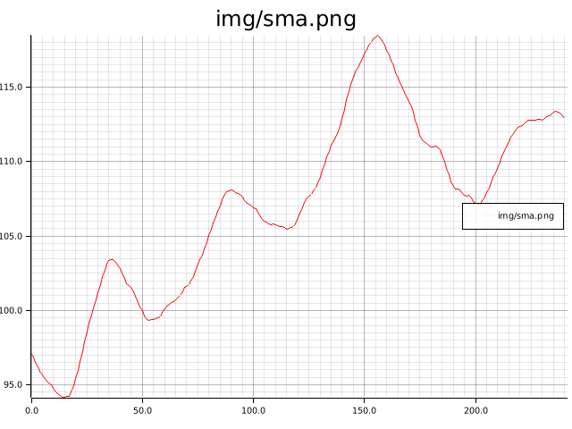
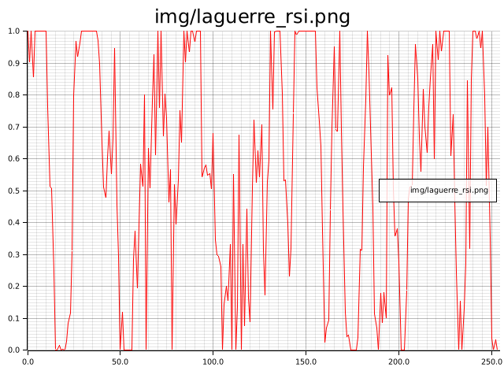
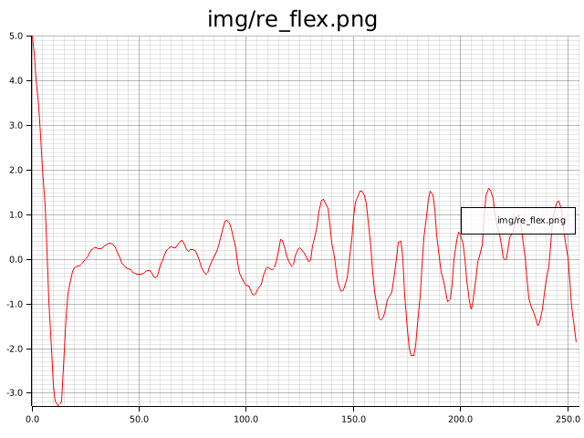

# Sliding Features
Modular, chainable sliding window with various signal processing functions and technical indicators including normalization. 
Values in window are updated with each call to update. 
A View defines the function which processes the incoming values and provides an output value. 
Views can easily be added by implementing the View Trait which requires two functions:
- update(&mut self, val: f64): Call whenever you have a new value with which to update the View
- last(&self) -> f64: Retrieve the last value from the View

There are two ways of creating a new View:
- new(view: Box<dyn View>, window_len: usize): Use if you want to chain another view to be calculated first
- new_final(window_len: usize): Use if this View will be the last in the chain
The last View which in each chain is always Echo, as this just echos the current value.
Some Views have additional parameters such as ALMA. They can be created using the new_custom() function.

A SlidingWindow can be used to hold multiple chained views, which hast the following function:
- new(): Create a new SlidingWindow
- register_view(&mut self, view: Box<dyn View>): add a chainable View 
- update(&mut self, val: f64): Update all Views with a new value
- last(&self) -> Vec<f64>: Get all the latest values from each View

This struct allows you to manage a bunch of Views at once and conveniently update them all.

### Usage
In your Cargo.toml add the crate:
```toml
sliding_features = "0.4.0"
```


### Basic single View example
```rust
/// Example showing how to use a single View
extern crate rust_timeseries_generator;

use rust_timeseries_generator::gaussian_process::gen;
use sliding_features::*;

fn main() {
    let mut rsi = Box::new(RSI::new_final(14));

    // generate dummy values
    let vals = gen(1024, 100.0);
    for r in &vals {
        rsi.update(*r);  // update the rsi computation with the newest value
        let last = rsi.last();  // get the latest rsi value
        println!("last rsi value: {:?}", last);
    }
}
```
See [examples/basic_single_view.rs](examples/basic_single_view.rs) for the code
Run the code using
```shell script
cargo run --release --example basic_single_view
```


### Basic Chainable Example
```rust
/// This Example provides a basic overview of chainable View definitions.
/// Assume you want to first transform your values with a Variance Stabilizing Centering Transform
//  and after that, smooth the values with an ALMA

// import the needed structs, and the View trait
use sliding_features::{ALMA, VSCT, View};

fn main() {
    // generate random value shifted up by 100.0 and scaled by 20.0,
    // a series which is neither centered around 0 nor variance stabilized
    let rands: Vec<f64> = (0..100)
        .map(|_| rand::random::<f64>() * 20.0 + 100.0)
        .collect();
    println!("rands: {:?}", rands);

    let window_len: usize = 20;
    let mut chain = ALMA::new(  // first, define the last function which gets applied in the chain
        Box::new(VSCT::new_final(window_len)), // Make the first transformation in the chain a VSCT
        window_len
    );
    for v in &rands {
        // the chain will first call the inner most view, which is Echo.
        // after that it will apply the VSCT transform
        // and finally apply an Arnaux Legoux moving average
        chain.update(*v);
        let last_value = chain.last();
        println!("transformed value: {}", last_value);
    }
}
```
See [examples/basic_chainable_view.rs](examples/basic_chainable_view.rs) for the code
Run the code using
```shell script
cargo run --release --example basic_chainable_view
```

NOTE: I am aware that the boxed View code looks ugly can get quite large for longer view chains.
if you happen to know a clean solution, please let me know or write a PR


### Multiple Sliding Features Example
```rust
/// Basic Example showing how to utilize a SlidingWindow to combine multiple chained views
use sliding_features::*;

fn main() {
    let mut sf = SlidingWindow::new();

    // lets register some of views, which will later be updated in a single step
    let window_len: usize = 16;
    sf.register_view(Box::new(RSI::new_final(window_len)));
    sf.register_view(Box::new(ROC::new_final(window_len)));
    // now a more complex view chain
    sf.register_view(
        Box::new(ALMA::new(
            Box::new(VSCT::new(
                Box::new(SMA::new_final(window_len)),
                window_len
            )),
            window_len
        ))
    );

    // generate random dummy values
    let rands: Vec<f64> = (0..100)
        .map(|_| rand::random::<f64>() * 20.0 + 100.0)
        .collect();
    for r in &rands {
        sf.update(*r);  // update all registered views with the newest value
        let last: Vec<f64> = sf.last(); // get the latest values from all views
        assert_eq!(last.len(), 3);  // because there are 3 registered views we get three ordered values
        println!("last values: {:?}", last);
    }
}

```
See [examples/basic_multiple_views.rs](examples/basic_multiple_views.rs) for the code
Run the code using
```shell script
cargo run --release --example basic_multiple_views
```


### Views
A View defines the function which processes value updates. They currently include:
* Echo
* Technical Indicators
    * Center of Gravity
    * Cyber Cycle
    * Laguerre RSI
    * Laguerre Filter
    * ReFlex
    * TrendFlex
    * ROC
    * RSI
    * Correlation Trend Indicator (CTI)
* Normalization / variance / mean standardization
    * HLNormalizer, a sliding high-low normalizer
    * Variance Stabilizing Transform (VST)
    * Variance Stabilizing Centering Transform (VSCT) 
* Moving Averages
    * ALMA (Arnaux Legoux Moving Average)
    * SMA (Simple Moving Average)
    
* Entropy (acts on a bit stream, thus does not impl View trait)


### Images
Underlying data synthetically generated by [MathisWellmann/rust_timeseries_generator](https://www.github.com/MathisWellmann/rust_timeseries_generator)
Note that each run is differently seeded by default.








### TODOs:
Feel free to implement the following and create a PR for some easy open-source contributions:
- EMA
- FRAMA
- MAMA
- FAMA
- Stochastic
- Super Smoother
- Zero Lag
- gaussian filter
- correlation cycle indicator
- and so much more...


### Contributing
If you have a sliding window function or indicator which you would like to integrate,
feel free to create a pull request. Any help is highly appreciated.
Let's build the greatest sliding window library together :handshake:


## License
Copyright (C) 2020  <MathisWellmann wellmannmathis@gmail.com>

This program is free software: you can redistribute it and/or modify
it under the terms of the GNU Affero General Public License as published by
the Free Software Foundation, either version 3 of the License, or
(at your option) any later version.

This program is distributed in the hope that it will be useful,
but WITHOUT ANY WARRANTY; without even the implied warranty of
MERCHANTABILITY or FITNESS FOR A PARTICULAR PURPOSE.  See the
GNU Affero General Public License for more details.

You should have received a copy of the GNU Affero General Public License
along with this program.  If not, see <https://www.gnu.org/licenses/>.


