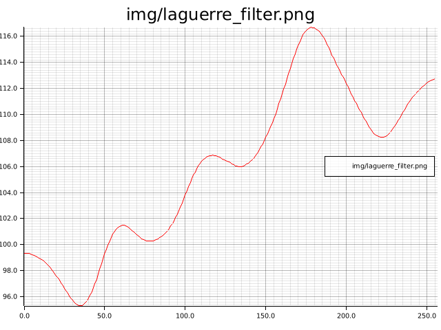
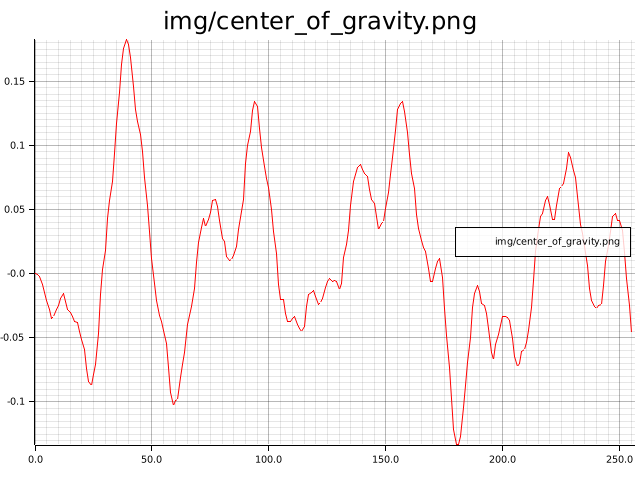
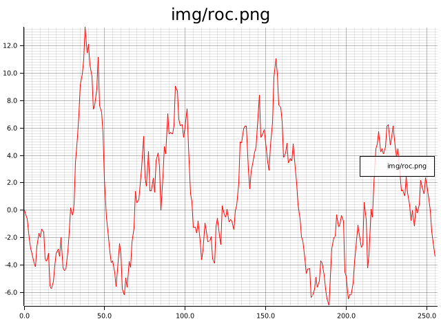
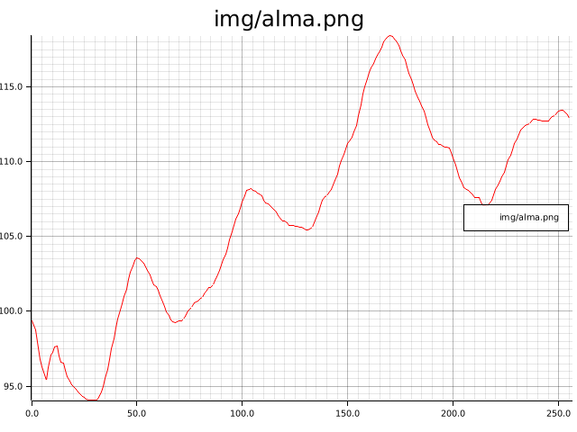

# Sliding Features
Modular sliding window with various signal processing functions and technical indicators including Normalization. Can be used for building low latency real-time trading systems. Values in window are updated at each time step. A View defines the function which processes the incoming values and provides and output value. Views can easily be added by implementing the View Trait which requires two functions:
- update(&mut self, val: f64)
- last(&self) -> f64

The Views can be parameterized as desired when created with new() function.
Add Views to SlidingWindow by calling register_view().
SlidingWindows last() function returns a vector of all the latest observations
of all views that are currently registered. 

### Example
```rust
extern crate rust_timeseries_generator;

use sliding_features::*;
use rust_timeseries_generator::gaussian_process::gen;

fn main() {
    // new sliding window
    let mut sf = SlidingWindow::new();

    let window_len: usize = 16
    // register some normalized indicators so output range is [-1.0, 1.0] 
    sf.register_view(Box::new(Normalizer::new(Box::new(RSI::new(window_len)), window_len)));
    sf.register_view(Box::new(Normalizer::new(Box::new(ROC::new(window_len)), window_len)));
    // register some variance stabilized indicators
    sf.register_view(Box::new(VST::new(Box::new(TrendFlex::new(window_len)))));
    sf.register_view(Box::new(VST::new(Box::new(CenterOfGravity::new(window_len)))));
    sf.register_view(Box::new(VST::new(Box::new(CyberCycle::new(window_len)))));

    // generate dummy values
    let vals = gen(1024, 100.0);
    for i in 0..vals.len() {
        // update all the sliding window features with a given value
        sf.update(vals[i]);
        // get the latest values from sliding window
        let last: Vec<f64> = sf.last();  
        println!("last: {:?}", last);
    }
}
```

See examples folder.
Run the examples using
```
cargo run --example simple
cargo run --example multiple
cargo run --example multiple_normalized
```

### Views
A View defines the function which processes value updates. They currently include:
* Echo
* Technical Indicators
    * Center of Gravity
    * Cyber Cycle
    * Laguerre RSI
    * Laguerre Filter
    * ReFlex
    * TrendFlex
    * ROC
    * RSI
    * Correlation Trend Indicator (CTI)
* Normalization / variance / mean standardization
    * Normalizer
    * Variance Stabilizing Transform (VST)
    * Variance Stabilizing Centering Transform (VSCT) 
* Moving Averages
    * ALMA (Arnaux Legoux Moving Average)
    
* Entropy (acts on a bit stream, thus does not impl View trait)

### Images
Underlying data synthetically generated by [MathisWellmann/rust_timeseries_generator](https://www.github.com/MathisWellmann/rust_timeseries_generator)
Note that each run is differently seeded by default.










### TODOs:
- SMA
- EMA
- FRAMA
- MAMA
- FAMA
- Stochastic
- Super Smoother
- Zero Lag
- gaussian filter
- and so much more...

### Contributing
If you have a sliding window function or indicator which you would like to integrate,
feel free to create a pull request. Any help is highly appreciated.
Let's build the greatest sliding window library together :handshake:

## License
Copyright (C) 2020  <MathisWellmann wellmannmathis@gmail.com>

This program is free software: you can redistribute it and/or modify
it under the terms of the GNU Affero General Public License as published by
the Free Software Foundation, either version 3 of the License, or
(at your option) any later version.

This program is distributed in the hope that it will be useful,
but WITHOUT ANY WARRANTY; without even the implied warranty of
MERCHANTABILITY or FITNESS FOR A PARTICULAR PURPOSE.  See the
GNU Affero General Public License for more details.

You should have received a copy of the GNU Affero General Public License
along with this program.  If not, see <https://www.gnu.org/licenses/>.


